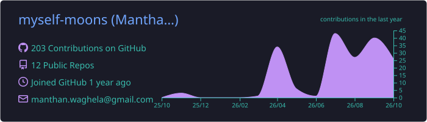
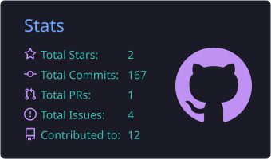
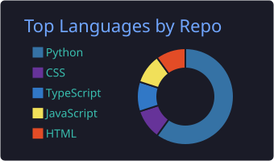

<!-- ═══════════ BANNER ═══════════ -->

---

### 👨‍💻 About Me

**IT Systems Coordinator & Data Analyst | Mumbai, India 🇮🇳**

I am the core of my data. 
Code is my body and logic is my blood. 
I have processed over a thousand datasets. 
Unknown to noise, 
Nor known to bias. 
Have withstood errors to create many models. 
Yet, those models will never stop learning. 
So, as I predict, Unlimited Data Works.

---

### 🔭 Some Updates

- 🔬 Currently working as an IT Systems Coordinator Intern at EbixCash World Money!
- 👯 Working on **convenient and efficient solutions** for non-technical peeps!
- 🌱 Learning **deployment, monitoring & CI/CD for ML**
- 💬 Ask me about **Data Analytics, Power BI, SQL & ML**

---

### 🛠️ Tech-Stack

 

<!--   -->

<!--   -->

---

### 📫 Reach Me Out

---

### 🚀 My Projects

| Project | What it does | Stack |
|---|---|---|
| 💳 [**CreditOps**](https://github.com/myself-moons/CreditOps) | Reproducible, end-to-end MLOps pipeline that trains and serves a credit card fraud classifier | Python, MLOps |
| 📈 [**Deep-Forecast**](https://github.com/myself-moons/Deep-Forecast) | Multivariate forecasting on stock market data using GRU and GenAI | Python, GRU |
| 📊 [**Power_Bi**](https://github.com/myself-moons/Power_Bi) | Dashboards and charts built with Power BI | Power BI, Power Query |
| 🧪 [**Job_Simulation**](https://github.com/myself-moons/Job_Simulation) | GenAI-powered data analytics job simulation by Forage | Python |

---

### 📊 My GitHub Stats

<!-- Generated into this repo by the "Profile Summary Cards" workflow.
     Run it once from the Actions tab or these images will be blank. -->

 

---
### 🪪 Trainer Card

<table>
  <tr>
    <td rowspan="6" align="center" valign="middle">
       
      <b>Trainer: Moons</b> 
      Unova Region · 4/5 Badges
    </td>
    <th>Skill</th>
    <th>Level</th>
    <th>Progress</th>
    <th>Badge</th>
  </tr>
  <tr>
    <td>🐍 Python</td>
    <td align="center">Lv. 80</td>
    <td><code>████████████████░░░░</code></td>
    <td>🥇 Trio Badge</td>
  </tr>
  <tr>
    <td>🗄️ SQL</td>
    <td align="center">Lv. 75</td>
    <td><code>███████████████░░░░░</code></td>
    <td>🔰 Basic Badge</td>
  </tr>
  <tr>
    <td>📊 Power BI</td>
    <td align="center">Lv. 70</td>
    <td><code>██████████████░░░░░░</code></td>
    <td>⚡ Bolt Badge</td>
  </tr>
  <tr>
    <td>🤖 Machine Learning</td>
    <td align="center">Lv. 60</td>
    <td><code>████████████░░░░░░░░</code></td>
    <td>🌋 Quake Badge</td>
  </tr>
  <tr>
    <td>🚀 MLOps</td>
    <td align="center">Lv. 40</td>
    <td><code>████████░░░░░░░░░░░░</code></td>
    <td>🔒 Jet Badge (in training)</td>
  </tr>
</table>

⚡ Currently training: deployment, monitoring & CI/CD for ML

---

### 🎮 My Pokémon Team

<table>
  <tr>
    <td align="center" valign="bottom" width="180" height="190"> <b>Lugia</b> Psychic / Flying</td>
    <td align="center" valign="bottom" width="180" height="190"> <b>Mega Audino</b> Normal / Fairy</td>
    <td align="center" valign="bottom" width="180" height="190"> <b>Leavanny</b> Bug / Grass</td>
  </tr>
  <tr>
    <td align="center" valign="bottom" width="180" height="190"> <b>Tyrantrum</b> Rock / Dragon</td>
    <td align="center" valign="bottom" width="180" height="190"> <b>Galvantula</b> Bug / Electric</td>
    <td align="center" valign="bottom" width="180" height="190"> <b>Falinks</b> Fighting</td>
  </tr>
</table>

---

> *"In Bhagwan Ji we trust. "*

